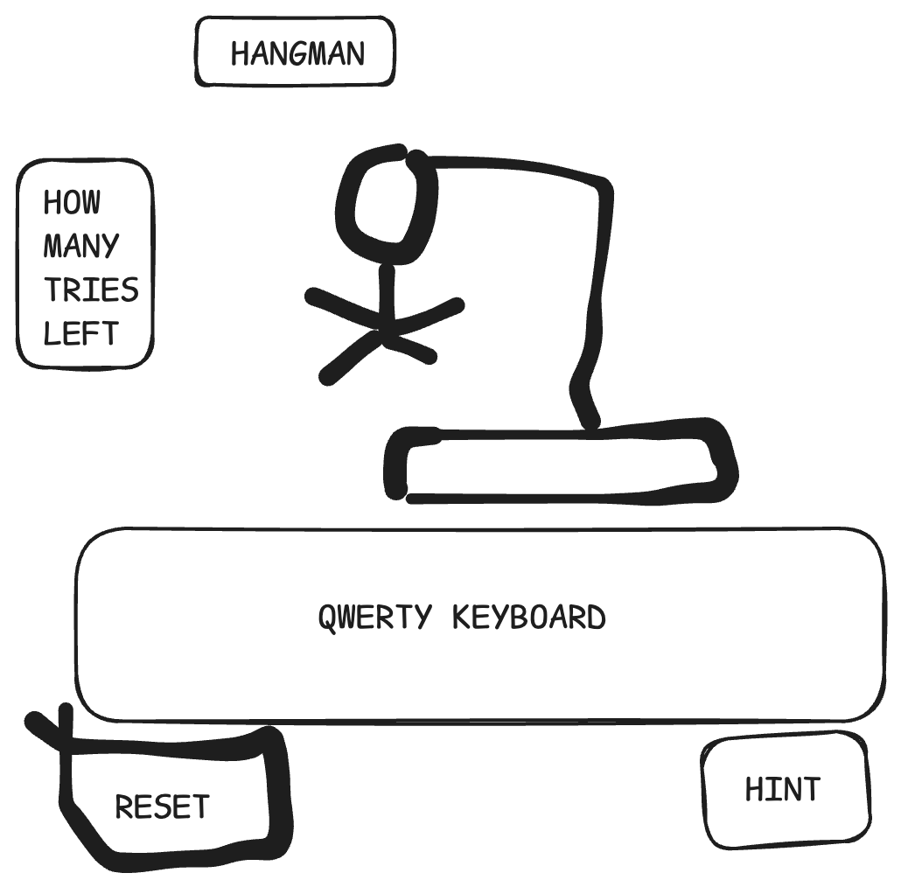

HANGMAN
    - Pick a random word from a category of words
    - make blank spaces for each letter in the word
    - Show number of tries left 

make a hint feature button
    - Hide the hint until the player clicks
-When player clicks a letter:
    - If the letter is in the word:
        - show the letter in the right space
    - If the letter is not in the word:
        - remove one "try"
        - Update the hangman drawing (choose graphic figure as hangman)
- When player clicks the hint button show a hint related to the answer or category

When the answer is completely guessed correctly, show a message stating the player won.
 - When the player runs out of turns, show a message stating the game is over but can be reset
    - Show the word
-When the player clicks the reset button start a new game with a new word
    - Clear the hangman
    - Reset tries and the new letters

# Hangman Wireframe

https://github.com/AGH528/hangman
